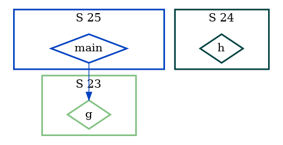
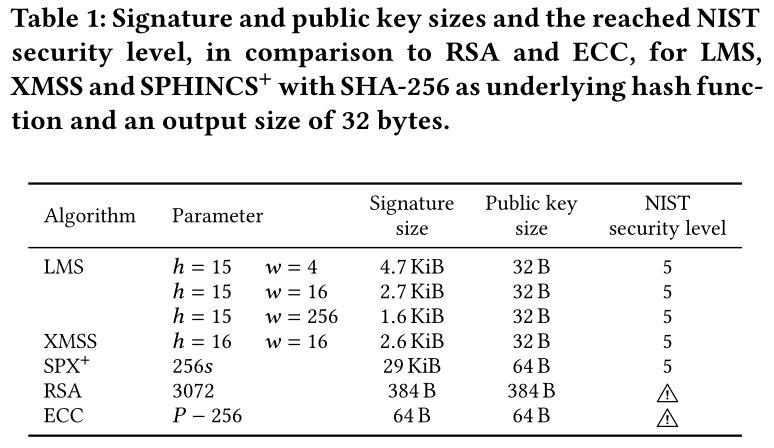

<center>

</center>

I am <a href="https://rehan-malak.github.io/">Rehan MALAK</a>. You can reach me by mail at FIRST.LAST AT gmail.com   (<a href="https://rehan-malak.github.io/gpg/rehan_2024.asc">GPG</a>)

This page talks about software engineering and more precisely about the __performance__ and the __security__ of low-level embedded software : bootloaders, operating systems, formal methods, cryptography, trusted execution environment, ...

# Table of contents
- [2012-2016 : DynQCD, BlueGene Q](#introduction)
- [2017 : Android, Cortex-A](#paragraph1)
- [2018 : Contiki-NG, Cortex-M](#paragraph2)
- [2019 : Frama-C, Why3](#paragraph3)
- [2020 : Lambdapi](#paragraph4)
- [2021 : Linux kernel, Why3](#paragraph5)
- [2022-2023 : SRAM PUF, MCUBoot, TEE](#paragraph6)
- [2024 : Hybrid Agile Post-Quantum Crypto ?](#paragraph7)

# Introduction : a long time ago <a name="introduction"></a>

###  2012-2016 : High Performance Computing

From 2012 to 2016, I got my PhD with a thesis on lattice QCD and high-performance computing. Lattice QCD is the discretized model of the strong interactions : those implying the stability of
the nuclei of the atoms. Within the Budapest-Marseille-Wuppertal collaboration, we computed challenging contributions to the [anomalous magnetic moment of the muon](https://en.wikipedia.org/wiki/Anomalous_magnetic_dipole_moment) with a low statistical error and a careful estimation of the systematic error. This has been made possible with
some theoretical work, the highly optimized DynQCD code and the massively parallel IBM BlueGene/Q's across the world.

<center>

</center>

For the details, look at this article "[HVP contrib to amu from first principles](https://arxiv.org/abs/1711.04980)" published in Physics Review Letter or the [slides](https://rehan-malak.github.io/presentations/Soutenance.pdf)
used at my PhD defense.

<center>

</center>

(__Update 2021__ : The BMW collaboration has made other breakthroughs since with this 2021
[paper](https://www.nature.com/articles/s41586-021-03418-1) published in _Nature_)

On the architecture side, IBM stopped its BlueGene line and the trend now in HPC centers is to evaluate the advantages of using heterogeneous architectures with ARM, RISC-V, GPU's and other domain specific accelerators.

(__Update 2022__ : An example of these new heterogeneous architectures is the ARM/Risc-V-based [Sipearl RHEA processor](https://events.prace-ri.eu/event/1214/contributions/1640/attachments/2084/4227/SiPearl_EuroHPC-Summit_V01.pdf).)

### 2017 : Embedded Systems <a name="paragraph1"></a>

In 2017, I worked for a french IoT company in New York City, working on a connected mirror running Android : EKKO©. The product won an
Innovation Award at CES 2017.

<center>

</center>

I was in charge of two aspects in particular : the Android ROM build process and the configuration and the optimization of the boot stages :
- the U-boot bootloader
- the Linux kernel
- the Android init

Android has a good documentation, the repo tool (a Python script to manage multiple git repo) is easy to use,
 the signing keys management are understandable, so the Android ROM build was the easy part. Problems went with the obsolete Linux
 kernel and U-boot bootloader version provided by the SBC manufacturer. No device tree of course !? (despite it was 6 years after the introduction of device
 trees in the kernel and 12 years after their usage in U-boot for PowerPC). One of the challenge was for example to get the LVDS screen
 working in the early boot stage. At the end, we managed to do it but it was a pain.

### Path to formal methods

HPC and Embedded Systems share some concerns : dealing with limited resources (CPU, RAM, I/O) and minimizing energy consumption. This goal
is usually achieved by using low-level but error-prone programming languages : C/C++/Assembly.

After these first experiences, I came back to France and started to work for Inria (National Institute for Research in Computer Science and Automation).

<center>

</center>

I will go through some experiments conducted at Inria (Lille, Saclay and Paris) between 2018 and 2021 with formal methods, low-level code or both. It contains also some links for the curious readers.

# 2018 : the 'S' in "IoT" stands for Security <a name="paragraph2"></a>

In 2018, I was part of the European H2020 [VESSEDIA](https://vessedia.eu/) project which aims at enhancing the security of IoT devices. One of the use-cases consisted in verifying the [Contiki-NG](https://github.com/contiki-ng/contiki-ng) IoT OS with the Frama-C analyzing platform.

The core of Frama-C can parse C programs and then its modular architecture allows to use interoperable _plugins analyzers_.

<!-- <center> -->
<!--  -->
<!-- </center> -->

<center>


</center>

<!-- <center> -->
<!--  -->
<!-- </center> -->

### Contiki-NG arch-specific code and callgraph with function pointers

Contiki-NG is ported on several boards based on low-power microcontrollers (as the ARM Cortex-M3).
Similar to the way the Linux kernel sources are split between the non-arch specific code (kernel/ fs/ block/ mm/ drivers/ ...) and the
arch specific one (arch/), Contiki-NG source code is split between os/ and arch/.

To provide some guidelines on how to port
the OS on new architectures, we tried to exhibit an "arch API" by looking how os/ calls arch/ at source-level. Tracing the _caller_ and the
_callee_ from execution would not provide exhaustive results.

At first, this task looked similar to the generation of multiple callgraphs and filtering what is going from arch/ to os/.

But arrives the problem of function pointers which are pervasive in C. Runtime callgraphs are trivial to generate with GCC instrumentation but how to do this
without running the code ?

Consider the following simple program ``test.c``

```c
void g() {}
void h() {}
int main(int argc,char *argv[])
{
        if (argc)
                g() ;
        else
                h() ;
        return 0;
}
```

Let's build the callgraph with llvm/clang :

```bash
clang -S -emit-llvm test.c -o test
opt -analyze -dot-callgraph test
dot -Tpng test.callgraph.dot -o test.png
```

We get :

<center>

</center>

Now let's add a function pointer in a new ``test2.c`` :

```c
void g() {}
void h() {}
int main(int argc,char *argv[])
{
	void (*f)(void) ;
	f = &g ;
	(*f)();
	f = &h ;
	(*f)();
	return 0;
}
```

We get this deceptive callgraph :

<center>

</center>

Let's try with Frama-C this time :

```bash
frama-c test2.c -cg test2.dot
dot -Tpng test2.dot -o test2.png
```

We get the correct callgraph :

<center>

</center>

In fact, Frama-C can do much better. Consider now this ``test3.c`` example :

```c
void g() {}
void h() {}
int main(int argc,char *argv[])
{
	void (*f)(void) ;
	if (argc)
		f = &g ;
	else
		if (argc)
			f = &h ;
	(*f)();
	return 0;
}
```

With the same Frama-C command, we obtain the same callgraph. But in reality, the ``h`` function wont ever be called if we look carefully at
the second ``if`` test. So we rebuild the callgraph, but this
time with a powerful static analysis technique : __abstract interpretation__ (with the Frama-C EVA plugin).

```bash
frama-c test3.c -eva -then -cg test3.dot
dot -Tpng test3.dot -o test3.png
```

<center>

</center>

... which is correct !

Using Frama-C, and with a bit of work, we managed to find the list of arch/ functions called by os/ functions and suggested an "arch API".
The interested reader can find more details in the [VESSEDIA report](https://vessedia.eu/downloads/VESSEDIA-D5.1-Inria-s-use-case-intermediate-report-PU-M18.pdf).

### The RTE & E-ACSL plugins and runtime verification

One objective of VESSEDIA was to investigate the security of Contiki-NG. In addition to
some bug fixes of the test suite of Travis-CI (and trivial bugs reported by the warnings of the, by then, new GCC 8), we tried to understand to what extent we could
apply E-ACSL to a whole kernel while E-ACSL is designed primarily for user-space programs.

There were several levels of integration that were envisaged. Contiki-NG can be built as :
1. an ELF x86 executable : the _hello world_ appears in Linux as a IPv6 pingable network interface
2. a firmware for ARM boards
3. a dynamic library loaded through JNI in the Java Cooja simulator. In this case, each loaded Contiki-NG instance acts as a node and one can
   simulate a entire IPv6 RPL mesh network

We tried 1. and 3.

(__Update 2023__ : I learned later many things about QEMU and it would be easier today to port on the few ARM Cortex-M emulated machines available in Qemu and integrate this in the Gitlab CI, I do this today with ARM, Risc-V and MIPS architectures)

The principle of E-ACSL is simple. Let's start with the simplest use of a pointer :

```c
int main()
{
	int i = 0 ;
	int *ptr = &i;
	*ptr = 0 ;
	return 0;
}
```

then the RTE plugin generates some ACSL specifications automatically :

```bash
frama-c -machdep gcc_x86_64 -rte test.c -print -ocode test.rte.c
```

which gives :

```c
int main(void)
{
int __retres;
int i = 0;
int *ptr = & i;
/*@ assert rte: mem_access: \valid(ptr); */
*ptr = 0;
__retres = 0;
return __retres;
}
```

then the E-ACSL plugin instruments the C code transforming ACSL assertion into runtime assertion :

```bash
frama-c -machdep gcc_x86_64 test.rte.c -e-acsl -then-last -print -ocode test.e-acsl.c
```

which gives (only the main function is shown) :

```c
...
int main(void)
{
  int __retres;
  __e_acsl_memory_init((int *)0,(char ***)0,(size_t)8);
  int i = 0;
  __e_acsl_store_block((void *)(& i),(size_t)4);
  __e_acsl_full_init((void *)(& i));
  int *ptr = & i;
  __e_acsl_store_block((void *)(& ptr),(size_t)8);
  __e_acsl_full_init((void *)(& ptr));
  {
    int __gen_e_acsl_initialized;
    int __gen_e_acsl_and;
    __e_acsl_assert_data_t __gen_e_acsl_assert_data = {.values = (void *)0};
    __e_acsl_assert_register_ptr(& __gen_e_acsl_assert_data,"&ptr",
                                 (void *)(& ptr));
    __e_acsl_assert_register_ulong(& __gen_e_acsl_assert_data,
                                   "sizeof(int *)",0,sizeof(int *));
    __gen_e_acsl_initialized = __e_acsl_initialized((void *)(& ptr),
                                                    sizeof(int *));
    __e_acsl_assert_register_int(& __gen_e_acsl_assert_data,
                                 "\\initialized(&ptr)",0,
                                 __gen_e_acsl_initialized);
    if (__gen_e_acsl_initialized) {
      int __gen_e_acsl_valid;
      __e_acsl_assert_register_ptr(& __gen_e_acsl_assert_data,"ptr",
                                   (void *)ptr);
      __e_acsl_assert_register_ulong(& __gen_e_acsl_assert_data,
                                     "sizeof(int)",0,sizeof(int));
      __gen_e_acsl_valid = __e_acsl_valid((void *)ptr,sizeof(int),
                                          (void *)ptr,(void *)(& ptr));
      __e_acsl_assert_register_int(& __gen_e_acsl_assert_data,"\\valid(ptr)",
                                   0,__gen_e_acsl_valid);
      __gen_e_acsl_and = __gen_e_acsl_valid;
    }
    else __gen_e_acsl_and = 0;
    __gen_e_acsl_assert_data.blocking = 1;
    __gen_e_acsl_assert_data.kind = "Assertion";
    __gen_e_acsl_assert_data.pred_txt = "rte: mem_access: \\valid(ptr)";
    __gen_e_acsl_assert_data.file = "test.rte.c";
    __gen_e_acsl_assert_data.fct = "main";
    __gen_e_acsl_assert_data.line = 7;
    __e_acsl_assert(__gen_e_acsl_and,& __gen_e_acsl_assert_data);
    __e_acsl_assert_clean(& __gen_e_acsl_assert_data);
  }
  /*@ assert rte: mem_access: \valid(ptr); */ ;
  __e_acsl_initialize((void *)ptr,sizeof(int));
  *ptr = 0;
  __retres = 0;
  __e_acsl_delete_block((void *)(& ptr));
  __e_acsl_delete_block((void *)(& i));
  __e_acsl_memory_clean();
  return __retres;
}
```

note that you can do it in only one step as Frama-C allows to use a pipeline of several program analyzers :

```bash
frama-c -machdep gcc_x86_64 test.c -rte -then -e-acsl -then-last -print -ocode test.e-acsl.c
```

then you compile the instrumented code against E-ACSL runtime library and the instrumented program exits prematurely if the program flow
goes through one failing assertion (there is also the ``report`` mode or the possibility to define your own assert C function).

For example, this incorrect access happens before the printing of "no problem" :

```c
#include <stdio.h>
int main()
{
	int i = 0 ;
	int *ptr = &i;
	*(ptr+1) = 0 ;
	puts("no problem\n");
	return 0;
}
```

```bash
$ ./test.e-acsl
	Assertion failed at line 6 in function main.
	The failing predicate is:
	rte: mem_access: \valid(ptr + 1).
	Aborted
```

Looking at the _segment_ memory model of E-ACSL for the Linux program memory layout (stack heap .bss .data .rodata .text) :

```c
/*****************************************************************************
 * Memory Layout *************************************************************
 *****************************************************************************
  ----------------------------------------> Max address
  Kernel Space
  ---------------------------------------->
  Non-canonical address space (only in 64-bit)
  ---------------------------------------->
  Environment variables [ GLIBC extension ]
 ----------------------------------------->
  Program arguments [ argc, argv ]
 -----------------------------------------> Stack End
  Stack [ Grows downwards ]
 ----------------------------------------->
  Thread-local storage (TLS) [ TDATA and TBSS ]
 ----------------------------------------->
  Shadow memory [ Heap, Stack, Global, TLS ]
 ----------------------------------------->
  Object mappings
 ----------------------------------------->
 ----------------------------------------->
  Heap [ Grows upwards^ ]
 -----------------------------------------> Heap Start [Initial Brk]
  BSS Segment  [ Uninitialised Globals ]
 ----------------------------------------->
  Data Segment [ Initialised Globals   ]
 ----------------------------------------->
  ROData [ Potentially ]
 ----------------------------------------->
  Text Segment [ Constants ]
 -----------------------------------------> NULL (0)
 *****************************************************************************
NOTE: Above memory layout scheme generally applies to Linux Kernel/gcc/glibc.
  It is also an approximation slanted towards 64-bit virtual process layout.
  In reality layouts may vary. Also, with mmap allocations heap does not
  necessarily grows from program break upwards. Typically mmap will allocate
  memory somewhere closer to stack. */

/* Struct representing a contigous memory region. Effectively this describes
 * a memory segment, such as heap, stack or segments in the shadow memory
 * used to track them. */
struct memory_segment {
  const char *name; //!< Symbolic name
  size_t size;      //!< Byte-size
  uintptr_t start;  //!< Least address
  uintptr_t end;    //!< Greatest address
  mspace mspace;    // !< Mspace used for the partition
  /* The following are only set if the segment is a shadow segment */
  struct memory_segment *parent; //!< Pointer to the tracked segment
  size_t shadow_ratio;           //!< Ratio of shadow to application memory
  /*!< Offset between the start of the tracked segment and the start of this
     segment */
  intptr_t shadow_offset;
};
```

and reading in ``/proc/$PID/maps`` the memory location of the loaded dynamic libraries (and other technical subtleties such as entry function being something else than the "main" function), we were able to instrument the whole ELF x86 Contiki-NG hello-world and run it.

Without too much difficulties, we were also able to instrument a Contiki-NG built as a shared dynamic library and loaded thanks to the libc _dlopen_ function.
But it was not possible to push further this result to the JNI case as it would have mean to make compatible the E-ACSL memory model with the way the
Java virtual machine loads JNI dynamic libraries.

As one can see though, the memory layout modelized in E-ACSL is adapted for x86 Linux ELF programs and adapt this to the variability of bare-metal ARM firmwares would have been difficult.

E-ACSL developers added in the Frama-C 19 _Potassium_ release the ``-e-acsl-functions`` and the ``-e-acsl-instrument``options to filter finely the functions to be instrumented but
it was not sufficient for our use-case. I still don't know if it is
technically possible to tune how the JVM loads JNI dynlibs such that E-ACSL memory segment model would remain relevant.

<center>

</center>

In conclusion, we succeed with 1. and only partially with 3. (_dlopen_ but no JNI)

So this opened the way to a use of E-ACSL for some Contiki-NG Travis-CI tests dealing with the pingable IPv6 stack but not the most
interesting ones with the complete RPL mesh network simulated inside the Java Cooja Simulator.

You can find more details on this experiment with E-ACSL in this [presentation](https://github.com/Rehan-MALAK/rehan-malak.github.io/blob/master/presentations/EACSL.pdf).

# 2019 (and 2021) : C AST to Why3 AST <a name="paragraph3"></a>

<center>

</center>

In 2019, I worked with the _Laboratoire de Recherche en Informatique_ (LRI) in Saclay where Frama-C and Why3 were co-invented with the
_Commissariat à l'énergie atomique_ (CEA).

Frama-C has a plugin for deductive verification called WP (for _weakest precondition calculus_). It generates some verification conditions
(VC) from the ACSL-specified C programs and performs a first pass of simplification (Frama-C QED) and then uses Why3 for the remaining
verification conditions and the interface with the SMT solvers. Unfortunately, it is a bit of a black box and the reports from the solvers
are difficult to use.

Some private partners of the LRI requested the possibility to get counter-examples from the SMT solvers in order to help them in their proofs.

You can find some explanations on the algorithms used in Alt-Ergo in this [presentation](https://rehan-malak.github.io/presentations/smt.pdf).

One idea was to simplify the C to Why3 compilation without the use of the huge WP codebase. Why3 is both an GTK-based IDE to work with the solvers
and a specified functional programming language close to Ocaml, called WhyML. In order to avoid the writing of another Why3 pretty printer (often
bugged, not maintained, etc...), one choice was to do the compilation from an AST to another AST. The Why3 parser is using Ocaml Menhir to
create a Why3.Ptree object (parser tree or "untyped" AST). We modified the Why3.Ptree object so the entire representation of a WhyML source
file fits into these objects. This has been merged in mainline Why3. An experimental plugin _Jessie3_ has been started from a previous
prototype called _Jessie_.
It already translates some ACSL specifications from C to Why3 but, because lack of time, only few of the Cil (the C AST from Frama-C) code were supported
at the time. I don't know if the private partners have continued to work on this plugin as their repo is closed-source.

__Update 2021__ : We also looked at the same idea but from unspecified C code. There are several C parsers in the Ocaml landscape
(probably not exhaustive) :
- C AST from [Compcert](https://compcert.org/index.html)
- C AST from [ClangML](https://gitlab.inria.fr/tmartine/clangml) (Ocaml bindings for clang)
- C AST from [Coccinelle](https://coccinelle.gitlabpages.inria.fr/website/download.html)

I find this approach more interesting because the Frama-C Cil AST does transformation by default that sometimes we would like to avoid (for
example with loops).

Proving directly in WhyML can also be more pleasant than adding ACSL specification in huge, complex and constantly evolving C codebases.

We still don't have a definitive answer on a sustainable way to prove C code but going in the other direction might also be a better
solution in the long term :
- avoid writing low-level C code where it is not needed
- find an adapted high-level programming language or create your own Domain Specific Language (DSL) easier to reason with and generates low-level code from it without too much overhead.
You can have a look at this informal
[presentation](https://github.com/Rehan-MALAK/rehan-malak.github.io/blob/master/presentations/Rehan.pdf) in French I made about the F*
programming language and the Kremlin compiler and its use for the cryptographic routines used in Wireguard (a clean VPN solution which have since been merged in
Linux), after the talks I found particularly interesting at the SSTIC 2018 and the KernelRecipes 2018 conferences.

# 2020 : Dedukti 3, a proof assistant leveraging higher order rewriting theory <a name="paragraph4"></a>

In 2020, I worked with the Inria Deducteam project-team. The team is specialized in proofs interoperability. In addition to their
expertise with proof assistants, they put forward a logical framework called λΠ-modulo-rewriting which is basically the same as the λΠ in
the Barendregt cube :

<center>

</center>

but with a extended conversion rule :

<center>

</center>

This framework is expressive enough to re-encode more complex type system as the one in the Coq proof assistant.

The implementation of the typechecker is called Dedukti. Deducteam has two objectives related :
1. Logipedia : use this theoretical framework to build the first online encyclopedia of proofs, with a set of traduction tools to go
  back-and-forth between the proof-assistant libraries one can find on the market
2. Dedukti3 : transform the basic Dedukti2 typechecker to a real proof assistant

I worked on 2. and one objective was to add a new kind of goals in the proof assistant to help the users in complex proofs. I summarize here
the differences between a type-checker and the wanted proof-assistant :

<center>

</center>

The _unification goals_ required modifications in the user-interaction engine and it has been merged in the mainline repo.
```ocaml
(** Type of unification constraints. *)
type constr = ctxt * term * term

(** Type of goals. *)
type goal_typ =
  { goal_meta : meta  (* Goal metavariable. *)
  ; goal_hyps : Env.t (* Precomputed scoping environment. *)
  ; goal_type : term  (* Precomputed type. *) }

type goal =
  | Typ of goal_typ (** Typing goal. *)
  | Unif of constr (** Unification goal. *)
```

Interesting new kind of _unification tactics_ should be written now to take advantage of it !

We also modified the LSP server (Language Server Protocol) of Dedukti 3 :

<center>

</center>

and the emacs plugin (the LSP client) :

<center>

</center>

You can find more details in this presentation I made for the Labex Digicosme (a granted French research project) : [Unification goals in Lambdapi](https://github.com/Rehan-MALAK/rehan-malak.github.io/blob/master/presentations/lambdapi.pdf)
with reminders about type theory, Curry-Howard correspondence and more...

Then I helped to adapt from Dedukti2 to Dedukti3, a semi-simplicial model of System F formalized initially by Bruno
Barras. The basic idea is simple (and the details far out-of-scope of this page) : the consistency of Homotopy Type Theory (HoTT) is currently based on models relying at the end on Set
Theory. (look at the initial [Kan-simplicial model from Kapulkin-Lumsdaine-Voevodski](https://arxiv.org/pdf/1211.2851.pdf) to get the precise requirements). This is not
satisfactory if HoTT is considered as a potential candidate for mathematical foundations (as was considered Set Theory at the beginning of
the XXth century by the German mathematicians, the "structuralists" and the mid-XXth century Bourbaki generations of mathematicians.)

If one want to formalize models of type theory in type theory, we have currently to :
- stay at a fixed level of truncation of the simplices

or

- keep the potentially infinite structure (and their "homotopic coherence") and add a second "external" non-decidable equality

This is where investigating the advantages of the decidable equality of the λΠ-modulo-rewriting framework becomes particularly
interesting. With a bit of work, one can do induction proofs on the dimension.

This is the paper we wanted to present for the Types2020 conference (one week before Italy got shut down and the conference cancelled
 because of the Covid19 restrictions).
__[A Semi-simplicial Model of System F in Dependent Type Theory Modulo
 Rewriting](https://types2020.di.unito.it/abstracts/BookOfAbstractsTYPES2020.pdf)__ does though only a fraction of the work to be
 done. A model for the System F universe allows quantification on the type but to reach dependent types theories, one needs the
 formalization of _category of families_ (CwF). Considering the complex nature of the combinatorial objects involved, this task could take
 advantage of the unification goals which have been added to Dedukti 3. New interesting unification tactics are missing though.

(__Update 2023__ : Note that instead of formalizing models of type theory, one can directly encode intensional Martin-Lof type theory in Lambdapi as done [here](https://github.com/Deducteam/ett-in-lambdapi/blob/main/ETT/ITT.lp) by Luc Chabassier who also added a new [tactic](https://github.com/dwarfmaster/commutative-diagrams) in a Coq plugin (written in Rust) to reason about diagrams in category theory.

(__Update 2023__ : A even more interesting approach in the search of formalizing mathematics in univalent foundations, would be to take advantage of this new interpretation/generaliztion of univalence for infiny categories instead of infiny groupoid. One can look for this at this [book on higher categories](https://cisinski.app.uni-regensburg.de/CatLR.pdf)
by Denis-Charles Cisinski (and [this book on the prerequisites on categories](https://math.jhu.edu/~eriehl/context.pdf) by Emily Riehl) and then look at their construction in
the two joined Arxiv papers [here](https://arxiv.org/abs/2210.08945) and [here](https://arxiv.org/abs/2210.07753). (here is the link to the 3-part lectures on this [part1](https://www.youtube.com/watch?v=5YOltuTcBK8) [part2](https://www.youtube.com/watch?v=xWmELBvHMPo) [part3](https://www.youtube.com/watch?v=P0Cfb4eUJo4)).
Now, as the notion of higher category is directly internalized, the problem is to find the suitable type theory itself (syntax, rules, ...) with the correct metaproperties (canonicity, termination, ... ). There will be a [summer school on this subject at Regensburg in September 2023](https://itp-school-2023.github.io/).

# 2021 : Linux scheduling : proofs, DSL, performance, liveness <a name="paragraph5"></a>

I Worked with the Inria Whisper team-project. The team is specialized in several aspects of
system software and formal methods :
- multicore RTOS, Linux kernel
- abstract interpretation, deductive verification
- performance, scheduling
- virtualization
- ...

One of the project I was involved in, is to prove a "local work conservation" property on the idle core selection algorithm of the Linux CFS scheduler
(_Completely Fair Scheduler_). This means that if a selected core gets overloaded (more than one runnable thread), there is no idle ones. In fact, because of concurrency, the definition has to be adapted as we will see.

But first a bit of context.

### Linux kernel market share

The Linux kernel is used on ~75% of the smartphones (Android Linux) and almost all the dataservers (cloud, webservers, ...) and all the top
500 supercomputers but only few percent of desktop computers. The process scheduler has to be reasonably efficient on a
vast variety of hardware with a vast variety of workloads.

<!-- ### Linux kernel SMP, RT, timers and lock brief history -->

<!-- - 1998, 2.0, symmetric multi-processor (SMP) support but with only one task in the kernel -->
<!-- - 1999, 2.2, concurrent execution with the introduction of the Big Kernel Lock (BKL) used both for preemption and SMP -->
<!-- - 2006, 2.6.16-2.6.19, high resolution timers merged in mainline from the PREEMPT_RT project -->
<!-- - 2007, 2.6.23, the completely fair scheduler (CFS) is the default (SCHED_NORMAL policy) -->
<!-- scheduler. -->
<!-- - 2011, 2.6.39, the last remaining traces of BKL have been replaced with the fine-grained lock mechanism : -->
<!--   * spinlock -->
<!--   * mutex -->
<!--   * read-copy-update (RCU) -->
<!-- - 2021, 5.15, lock mechanims of PREEMPT_RT merged in mainline -->

### Linux CFS : per-cpu distributed scheduler plus load-balancing

On a single core, the algorithm is simple : the tasks can be preempted, there is an amount of time (a few milliseconds) during which every task has to
be in the running state, the amount of time is divided between the tasks following their priorities (Unix niceness).

On a multicore machine, Linux CFS is a bit more complicated. To have some scalability, the scheduler is basically a distributed monocore
scheduler without lock on read + a load-balancing mechanism. Because there is no lock on read, with concurrency, the per-cpu read values, for example
nr_running (the number of runnable threads on a particular logical CPU) can be outdated, implying sometimes bad decisions. (thought to be
compensated by the lockless design)

On a multicore NUMA modern machine with a hierarchy of cache memories, Linux CFS is really complicated :
the load balancing is performed at different level at different frequency, there are some heuristics on the interpretation of the load
statistics, other heuristics to find dependency between the current task and the waked task to assure cache coherency, ...

<center>

</center>

The hardware has to expose the topology to Linux and this is architecture dependent (ACPI is used in the x86 case). Linux CFS seems to have been designed with x86 in mind.
One can find more details on how to simulate interesting CPU/NUMA topology with QEMU on this informal [Topology/Numa with
Qemu/Linux](https://rehan-malak.github.io/presentations/numa.pdf) presentation.

All in all, the lines of code (loc) of ``kernel/sched/fair.c`` in Linux 5.15 is more than the loc of the whole Linux 0.01 version.
There are regularly some bugs and performance regression implying energy waste. For more details, look at this interesting paper : [A decade of wasted cores](https://hal.archives-ouvertes.fr/hal-01295194/document). This motivated the Whisper team and the Lip6 laboratory to work on a __Scheduler as a kernel module__ solution (explained in this
[thesis](https://hal.archives-ouvertes.fr/tel-02977242/document)) compiled from a scheduling policy formalized in a domain specific language. One can find the compiler and policy examples [here](https://gitlab.inria.fr/ipanema-public/).

### Linux scheduling class

Note also that there are other _scheduling classes_ in the kernel for real-time tasks :
- Deadline
- Realtime (posix)

<center>

</center>

<!-- enqueue_task(rq, t) Add thread t to runqueue rq -->
<!-- dequeue_task(rq, t) Remove thread t from runqueue rq -->
<!-- yield_task(rq) Yield the currently running thread on the CPU of rq -->
<!-- check_preempt_curr(rq, t) Check if the currently running thread of rq should be pre- -->
<!-- empted by thread t -->
<!-- pick_next_task(rq) Return the next thread that should run on rq -->
<!-- put_prev_task(rq, t) Remove the currently running thread t from the CPU of rq -->
<!-- set_next_task(rq, t) Set thread t as the currently running thread on the CPU of rq -->
<!-- balance(rq) Run the load balancing algorithm for the CPU of rq -->
<!-- select_task_rq(t) Choose a new CPU for the waking up/newly created thread t -->
<!-- task_tick(rq) Called at every clock tick on the CPU of rq if the currently -->
<!-- running thread is in this scheduling class -->
<!-- task_fork(t) Called when thread t is created after a fork()/clone() system -->
<!-- call -->
<!-- task_dead(t) Called when thread t terminates -->

Each class implements the functions of the scheduling class API.

| API               | Description    | Deadline    | Realtime    | Fair        |
| ----------------- | ---------------| ----------- | ----------- | ----------- |
| enqueue_task      | add thread to runqueue            | enqueue_task_dl          | enqueue_task_rt               | enqueue_task_fair   |
| dequeue_task      | remove thread from runqueue       | dequeue_task_dl          | dequeue_task_rt               | dequeue_task_fair   |
| yield_task        | yield current                     | yield_task_dl            | yield_task_rt                 | yield_task_fair                  |
| check_preempt_curr| should current be preempted ?     | check_preempt_curr_dl    | check_preempt_curr_rt         | check_preempt_curr_fair   |
| pick_next_task    | next to run                       | pick_next_task_dl        | pick_next_task_rt             | pick_next_task_fair   |
| put_prev_task     | remove current                    | put_prev_task_dl         | put_prev_task_rt         	   | put_prev_task_fair   |
| set_next_task     | set current                       | set_next_task_dl         | set_next_task_rt         	   | set_next_task_fair   |
| balance        | load-balance algorithm               | balance_dl      		   | balance_rt					   | balance_fair   |
| select_task_rq  | select core                         | select_task_rq_dl        | select_task_rq_rt             | __select_task_rq_fair__ |
| task_tick        | do at every tick                   | task_tick_dl             | task_tick_rt                  | task_tick_fair   |
| task_fork       | when fork/clone syscall             | task_fork_dl             | task_fork_rt                  | task_fork_fair   |
| task_dead      | when terminating                     | task_dead_dl             | task_dead_rt                  | task_dead_fair   |
| ... | ... | ... | ... | ... |

So the core selection algorithm for the CFS class is in __select_task_rq_fair__

```c
/*
 * select_task_rq_fair: Select target runqueue for the waking task in domains
 * that have the relevant SD flag set. In practice, this is SD_BALANCE_WAKE,
 * SD_BALANCE_FORK, or SD_BALANCE_EXEC.
 *
 * Balances load by selecting the idlest CPU in the idlest group, or under
 * certain conditions an idle sibling CPU if the domain has SD_WAKE_AFFINE set.
 *
 * Returns the target CPU number.
 */
static int
select_task_rq_fair(struct task_struct *p, int prev_cpu, int wake_flags)
{
	int sync = (wake_flags & WF_SYNC) && !(current->flags & PF_EXITING);
	struct sched_domain *tmp, *sd = NULL;
	int cpu = smp_processor_id();
	int new_cpu = prev_cpu;
	int want_affine = 0;
	/* SD_flags and WF_flags share the first nibble */
	int sd_flag = wake_flags & 0xF;

	/*
	 * required for stable ->cpus_allowed
	 */
	lockdep_assert_held(&p->pi_lock);
	if (wake_flags & WF_TTWU) {
		record_wakee(p);

		if (sched_energy_enabled()) {
			new_cpu = find_energy_efficient_cpu(p, prev_cpu);
			if (new_cpu >= 0)
				return new_cpu;
			new_cpu = prev_cpu;
		}

		want_affine = !wake_wide(p) && cpumask_test_cpu(cpu, p->cpus_ptr);
	}

	rcu_read_lock();
	for_each_domain(cpu, tmp) {
		/*
		 * If both 'cpu' and 'prev_cpu' are part of this domain,
		 * cpu is a valid SD_WAKE_AFFINE target.
		 */
		if (want_affine && (tmp->flags & SD_WAKE_AFFINE) &&
			cpumask_test_cpu(prev_cpu, sched_domain_span(tmp))) {
			if (cpu != prev_cpu)
				new_cpu = wake_affine(tmp, p, cpu, prev_cpu, sync);

			sd = NULL; /* Prefer wake_affine over balance flags */
			break;
		}

		if (tmp->flags & sd_flag)
			sd = tmp;
		else if (!want_affine)
			break;
	}

	if (unlikely(sd)) {
		/* Slow path */
		new_cpu = find_idlest_cpu(sd, p, cpu, prev_cpu, sd_flag);
	} else if (wake_flags & WF_TTWU) { /* XXX always ? */
		/* Fast path */
		new_cpu = select_idle_sibling(p, prev_cpu, new_cpu);
	}
	rcu_read_unlock();

	return new_cpu;
}
```

In we don't take into account the subalgorithm trying to find an energy-efficient core, one
can split the __select_task_rq_fair__ in 2 cases :

- WAKE _fast path_ : __wake_wide__ __wake_affine__ and __select_idle_sibling__
- FORK/EXEC _slow path_ : __find_idlest_cpu__

The WAKE case chooses the previous core on which the task was running or an idle sibling one sharing the same last-level-cache (LLC).
The FORK/EXEC case chooses an idle core in increasing level of the domain (_scheduler domain_) :
* Simultaneous multithreading (SMT)
* Multi-Core Cache (MC)
* Package (DIE)

### Work conservation

Formally, __local work conservation__ (LWC) is (with c the selected core, O(c) meaning the selected core runqueue has more strictly more than 1 runnable thread
and I(c) if the runqueue has no runnable thread) :

<center>
LWC(c) : O(c) ⇒ ∀c′.¬I(c′)
</center>

Because of a concurrent core (with its own scheduler decisions), O(c) may become true. More generally, we have to adapt the definitions of
_overloaded_ and _idle_ to the distributed design of CFS : they are not taken in account unblock (U), block (B) and or another scheduling
happening on our studied core c :

<center>
CO(c) ≡ O(c)∧¬U(c)
</center>

<center>
CI(c) ≡ I(c)∧¬B(c)∧¬E(c)
</center>

Concurrent local work conservation is then :

<center>
CLWC(c) : CO(c) ⇒ ∀c′.¬CI(c′)
</center>

More details on the definitions in this [article](https://hal.inria.fr/hal-02554342/document).

We are currently trying to prove a modified version of CLWC but adapted to how Linux is trying to find an idle core on siblings core.

In any case, proving a complex piece of software as (small parts of) the Linux kernel CFS is hard. And several aspects are though not taken in account :
- the frequency aspect with not-so-well-documented architecture dependent characteristics
- the big.LITTLE architectures with high-performance core and low-energy consumption ones (as the recent Apple M1)

Moreover, in concrete industrial usecases, one sees systems configured with mixed scheduling class/policy and this adds another class of problems.

### From work conservation to timing properties

Following the previous observations, I got more and more interested by timing properties, traces and models.

For more details on the preemption configuration, the scheduling latency of real-time Linux kernels, you can look at these informal presentations I made :
- [PREEMPT_RT and model of scheduling latency](https://rehan-malak.github.io/presentations/rtlinux.pdf)
- [Mixed CFS and RT scheduling classes/policies problematic usecases](https://rehan-malak.github.io/presentations/rtlinux2.pdf) (following
  some recent interesting talks at LPC 2020 and LPC 2021)

# 2022-2023 : SRAM PUF, Cryptography and Trusted Execution Environment <a name="paragraph6"></a>

In 2022, I moved from Paris to Eindhoven in Netherlands. I am currently working at _[Intrinsic ID](https://www.intrinsic-id.com/)_ on cryptography on x86 / ARM / Risc-V architectures.
<center>

</center>

Intrinsic ID is the world leader on SRAM PUF and I am specifically working on _[Zign](https://www.intrinsic-id.com/products/zign/)_, a software-only solution to generate (SRAM PUF based) cryptographic keys and a NIST-compliant Random Number Generator (_[Zign RNG](https://www.intrinsic-id.com/products/zign-rng/)_) for  Arm and Risc-V microcontrolers and processors.

The principle is simple. The details on how to do this right are not.

First remind that a standard cell of Static RAM (SRAM) is 6 transistors combined in the following way :

<center>

</center>

While this can store 1 bit of memory (0 or 1), a powered uninitialized cell of SRAM can have any of the two states, but one state is more likely than the other depending on the microstructure of the silicium.

In fact, with a correctly tuned error correction code (the so-called _Fuzzy Extractor_), one can recreate from our uninitialized standard SRAM a device unique identity, recreated at each startup, without storing any sensible material. Even the manufacturer cannot clone exactly the silicium chip in all its microscopic detail, so the the device is truely **uniquely identified** and the SRAM behaves as a **Physical Unclonable Function (PUF)**.

On the contrary, the uninitialized SRAM exibit some noise than can be used as a very good quality random bit generator (RBG) to get a NIST SP800-90A/B compliant Random Number Generator (RNG).

Intrinsic ID has conducted research showing that this technology works :
- from 0.35 μm to 5 nm
- from -55°C to 150°C
- with supply voltage variation +/- 20%
- with lifetime > 25 years

This make the possibility to authenticate almost anything **WITHOUT THE NEED FOR NEW HARDWARE**... just a kB of the standard Static RAM.

And this works flawlessly on many popular boards. A few examples of boards we use everyday...

From small Cortex-M0 based (here ST stm32l072) to powerful Cortex-M4 based (here NXP lpc54114) :

<center>


</center>

From the popular Risc-V board (here the Sifive E) to the more exotic one (here the Longan nano) :

<center>


</center>

and many others...

To help the adoption of such an amazing technology, we have already integrated Zign and Zign RNG with popular
crypto-libraries such as :
- MbedTLS
- WolfSSL
- OpenSSL

This opens the path to many interesting applications almost for "free".

For example, by leveraging the PSA_BUILTIN_KEY concept of the new PSA API of MbedTLS,
one can get many of the cryptographic services provided by Trusted Firmware M / A without even storing an actual key.

Indeed, in the context of the Platform Security Architecture (PSA), the chain-of-trust MCUBoot -> Trusted Firmware-M is using MbedTLS as the crypto library.

So by integrating Zign with MbedTLS, we get :

<center>

</center>

where the payload is the one of your choice : Zephyr, FreeRTOS, a custom one...

If Trustzone is a no-go, the same kind of idea can apply with simpler lightweight design, for example, only MCUBoot.

# 2024 : Hybrid and Agile Post-Quantum Cryptography for the modern secured platform architectures ? <a name="paragraph7"></a>

Synopsys has acquired Intrinsic ID. So Zign is now the [Synopsys Software based PUF IP](https://www.synopsys.com/designware-ip/security-ip/cryptography-ip/puf.html)

And now ?

Reading some papers about hash-based (stateful or stateless) signature for PQC-compliant Secure Boot and HW/SW codesign to get this faster.

For example, this kind of Table from a [Fraunhofer institute team](https://eprint.iacr.org/2022/1198) :
<center>

</center>
